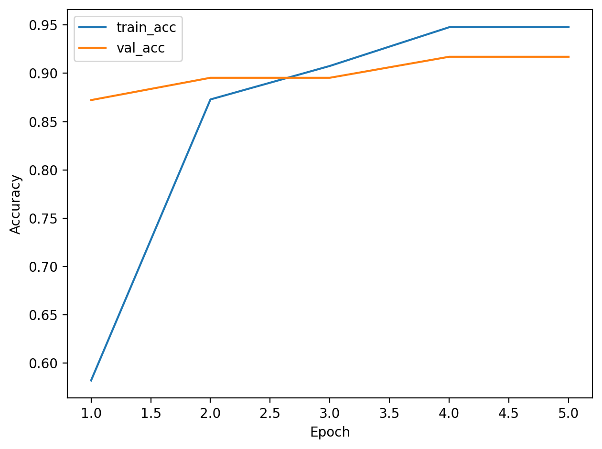
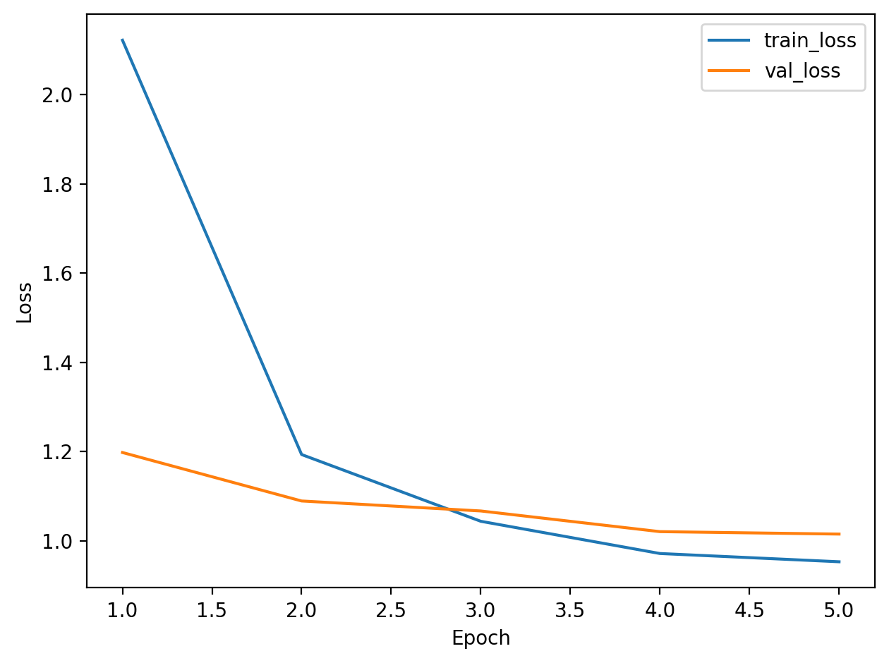
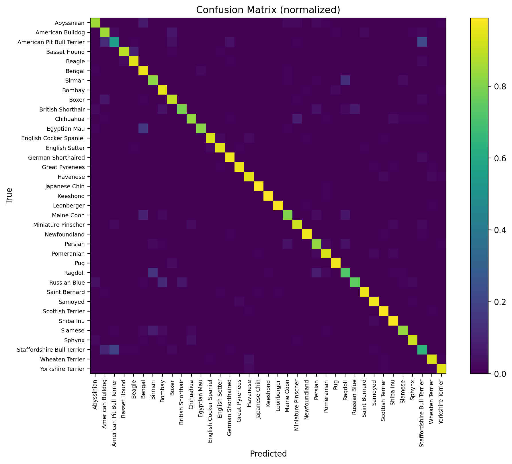
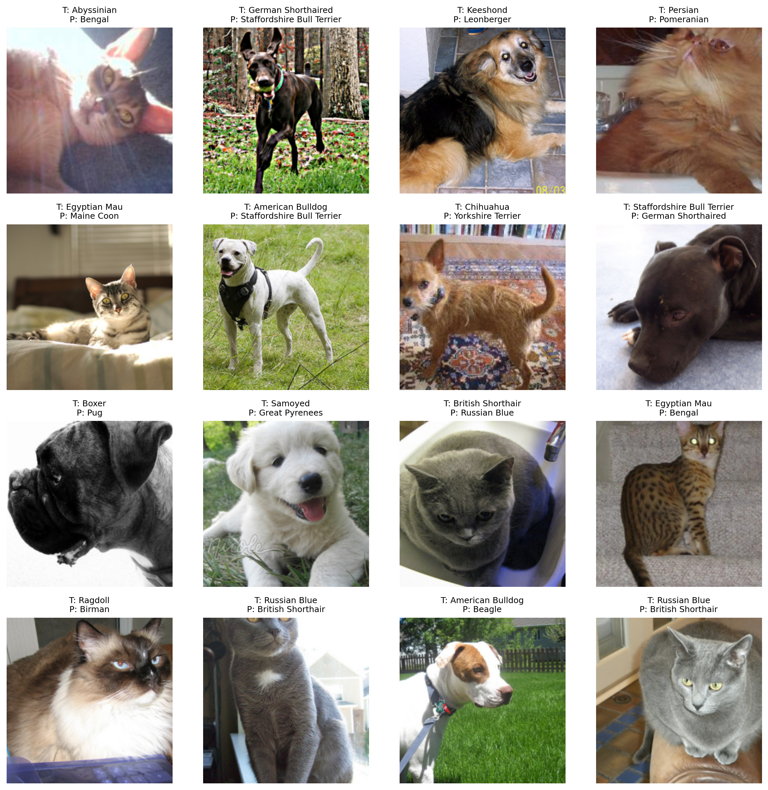

# Oxford-IIIT Pets Classification (ResNet18 Transfer Learning)

Image classification project using the Oxford-IIIT Pets dataset (37 classes).  
Trains a ResNet18 model with transfer learning and evaluates performance on a held-out test set.

This repo includes:
- a baseline (train classifier head only)
- an improved model (fine-tune ResNet layer4 + head)
- scripts to evaluate on test and predict on a single image
- lightweight pytest tests for core utilities

---

## Results (summary)

- Validation accuracy (layer4 fine-tuning): ~91–92%
- Test accuracy (final model): ~89–90% (e.g. 88.9% on final run)

> Note: the training set can reach very high accuracy (e.g. ~99%), which indicates overfitting.  
> This project mitigates it with stronger augmentation and label smoothing.

---

## Dataset

This project uses the dataset built into `torchvision`:

- `torchvision.datasets.OxfordIIITPet`
- Split: `trainval` (further split into train/val) + official `test`

The dataset is downloaded automatically to:

- `data/` (ignored by git)

---

## Setup

### Requirements
- Python 3.11+
- Poetry

Install dependencies:

```bash
poetry install
```

## Running
Run commands from the project root.

### Baseline (train head only)
```bash
PYTHONPATH=src poetry run python scripts/train_baseline.py
```

Outputs:
- models/best_resnet18_head_only.pth
- reports/figures/*baseline*.png
- reports/tables/*baseline*.csv
- reports/tables/class_names.json

### Fine-tune (final model: layer4 + head)
```bash
PYTHONPATH=src poetry run python scripts/train_layer4.py
```

Outputs:
- models/best_resnet18_layer4.pth
- training curves, confusion matrices, error gallery
- per-class accuracy CSVs

### Evaluate on test (one-time final evaluation)
```bash
PYTHONPATH=src poetry run python scripts/evaluate_test.py --ckpt models/best_resnet18_layer4.pth
```

This prints test loss/accuracy and saves:
- reports/figures/confusion_matrix_test.png
- reports/tables/per_class_accuracy_test.csv

### Single image prediction
Predict top-k classes from a local image:
```bash
PYTHONPATH=src poetry run python scripts/predict.py --image path/to/image.jpg --topk 3 --ckpt models/best_resnet18_layer4.pth
```

```
Example output:
Top-3 predictions:
 1. american_bulldog              prob=0.8123
 2. staffordshire_bull_terrier    prob=0.1034
 3. boxer                         prob=0.0412
 ```

### Tests
Run unit tests:
```bash
PYTHONPATH=src poetry run pytest -q
```

---

## Artifacts (plots and tables)

This repo generates plots and tables under reports/.
- Training curves: reports/figures/layer4_finetune_acc.png, reports/figures/layer4_finetune_loss.png
- Confusion matrix: reports/figures/confusion_matrix_test.png
- Per-class accuracy: reports/tables/per_class_accuracy_test.csv

## Notes
- Data augmentation is applied only to training.
- Validation/test use deterministic transforms.
- Model selection is based on validation accuracy; test evaluation is performed after finalizing the approach.

---
## Results (visuals)

### Training curves (layer4 fine-tuning)




### Test confusion matrix



### Validation error gallery


